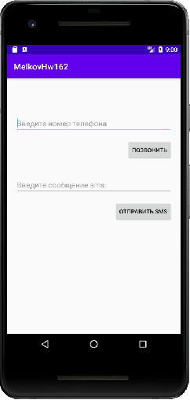

## Задача 2. Позвонить по телефону/отправить СМС
### Описание
Корпоративные мобильные приложения часто предлагают своим пользователям функцию звонка на рабочий номер (на горячую линию) или отправки СМС по номеру мобильного. Создадим такой экран.

Для этого создайте новый экран со следующими элементами:
- EditText для ввода номера телефона;
- EditText для ввода СМС-сообщения;
- Кнопка “Звоним”- по нажатию на нее открывается звонок пользователю;
- Кнопка “Отправляем”- по нажатию на нее пользователю отправляется СМС с текстом из EditText-а.

